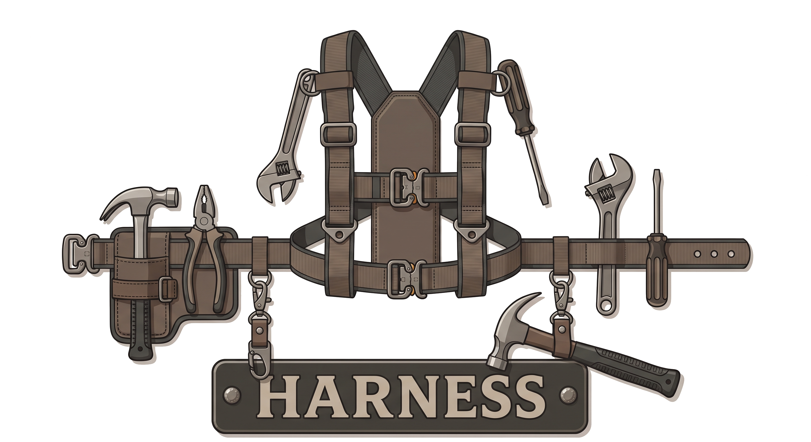

<div align="center">
  <br />
  <p align="center">
    
  </p>

  ### **O Harness Multi-Agente Declarativo, Auditável e de Alta Fidelidade para OpenCode**

  [](https://github.com/alexandre-henrique-rp/harnes-opencode/releases)
  [](LICENSE)
  [](https://opencode.ai)
  [](https://bun.sh)
  
  <p align="center">
    <a href="#-sobre-o-projeto">Sobre o Projeto</a> ·
    <a href="#-instalação-rápida">Instalação Rápida</a> ·
    <a href="#-sprints--workflow">Fases e Workflow</a> ·
    <a href="#-time-de-agentes-roster">Time de Agentes</a> ·
    <a href="#-princípios-não-negociáveis">Princípios</a> ·
    <a href="#-protocolo-de-falhas">Protocolo de Falhas</a>
  </p>
</div>

---

## 📖 Sobre o Projeto

O **OpenCode Agents v6** é um harness declarativo, auditável e auto-modificável de desenvolvimento multi-agente de alta fidelidade integrado ao ecossistema OpenCode. 

Inspirado nas práticas de *vibe-coding* e Extreme Programming (XP), como programação em par, TDD, entregas contínuas e padrões de código estritos, este harness organiza o ciclo de desenvolvimento em **6 fases controladas** e gerencia **20 agentes especializados** com limites rígidos de escrita (path boundaries) e controle total de auditoria.

### 🌟 Diferenciais Competitivos (vs v5)
* **Eficiência Extrema:** Redução de **58% no volume de arquivos** (50 vs 119) para um harness muito mais leve e otimizado.
* **Segurança e Boundaries:** Permissionamento baseado em 3 camadas (tool whitelist + path boundary por agente + capability grant).
* **Conformidade LGPD:** DPO/Advogada digital integrada de fábrica que roda de forma assíncrona ao final de cada sprint para validar a conformidade da infraestrutura e banco de dados.
* **Strict vs Lean:** Escolha entre o fluxo corporativo completo com auditorias rigorosas ou o fluxo `lean` rápido de 3 fases (Briefing, Planejamento e Build).

---

## ⚡ Instalação Rápida

> [!IMPORTANT]
> **Pré-requisito Obrigatório:** Você precisa ter a CLI oficial do **OpenCode** instalada no sistema para rodar o harness.
> Se você ainda não possui o OpenCode instalado, instale-o primeiro executando o comando oficial:
> ```bash
> curl -fsSL https://opencode.ai/install | bash
> ```

Com o OpenCode instalado, execute o comando único abaixo no seu terminal para instalar ou atualizar o Harness v6:

```bash
curl -fsSL https://raw.githubusercontent.com/alexandre-henrique-rp/harnes-opencode/main/install.sh | bash
```

> [!NOTE]
> O instalador é **100% interativo**. Ele detecta automaticamente se você já possui chaves de API do Google Stitch configuradas ou MCPs customizados e realiza um **Smart Merge** automático, mantendo as suas credenciais seguras e criando um backup de segurança em `backup/backup_YYYYMMDD_HHMMSS/opencode.jsonc`.

### Inicialização no Projeto
Entre no diretório do seu projeto de software e chame o harness no runtime do OpenCode:
```bash
cd /caminho/do/seu/projeto
opencode /harness
```
*Para usar o perfil simplificado (ideal para pequenos projetos ou prototipagem):*
```bash
opencode /harness-init --project meu-projeto --profile lean
```

---

## 🔄 Fases e Workflow

O ciclo de desenvolvimento é orquestrado em **6 fases sequenciais**, onde cada fase possui um **Portão (Gate) Binário** que precisa ser obrigatoriamente aprovado para transicionar para o próximo passo.

| # | Fase | Agentes Responsáveis | Artefato Gerado | Portão de Validação (Gate) |
| :--- | :--- | :--- | :--- | :--- |
| **0** | **Briefing** | `briefing` | `.harness/brief.md` | Aprovação do usuário no plano de briefing |
| **1** | **Documentação** | `documenter` + `rag-curator` | `AGENTS.md` + `RAG/index.json` | Validação de presença e mínimo de 3 docs |
| **2** | **Requisitos** | `requirements` + `prd-reviewer` + `spec-reviewer` | `PRD.md` + `SPEC.md` | Avaliação de score técnico (PRD ≥ 80, SPEC ≥ 85) |
| **3** | **Design** | `designer` + `design-reviewer` | `PRODUCT.md` + `<page>.DESIGN.md` | Score estético de UI/UX (Design ≥ 70) |
| **4** | **Planejamento** | `sprint-tasker` + `planning-reviewer` | `.harness/sprints/*.json` | Cobertura total (100% dos itens da SPEC mapeados) |
| **5** | **Build + Quality** | orchestrator + implementar + testar + auditors | Código fonte + Testes + Logs | Cobertura de testes ≥ 85%, 0 bugs graves e conformidade LGPD |

---

## 👥 Time de Agentes (Roster)

O harness opera em estrutura hierárquica baseada em delegação direcionada. Nenhum subagente possui capacidade de execução genérica fora do seu escopo físico delimitado.

```
orchestrator (Primary)
├── briefing (Briefing inicial)
├── documenter (Documentação do projeto) ── rag-curator (Gerenciamento de RAGs)
├── requirements (Levantamento de PRD/SPEC) ── prd-reviewer, spec-reviewer (Revisões)
├── designer (Design e Stitch UI) ── design-reviewer (Auditor de a11y/Impeccable Bans)
├── sprint-tasker (Planejamento de Tarefas) ── planning-reviewer (Validação de cobertura)
└── Implementação e Qualidade (Fase 5)
    ├── backend (Desenvolvedor de APIs e Lógica)
    ├── frontend (Desenvolvedor de Telas e Estilos)
    ├── tester (Criador e Executor de Casos de Teste)
    ├── security (Varreduras de vulnerabilidades e XSS)
    ├── lgpd-officer (DPO - Auditora jurídica de conformidade digital)
    └── qa-gate (Revisor final de entrega de build)
```

---

## 🛑 Princípios Não-Negociáveis

Para garantir que a IA produza códigos limpos e funcionais sem introduzir "lixo" ou padrões genéricos de IA, o harness reforça 8 regras estruturais em todos os agentes:

1. **Single Responsibility:** Cada agente resolve apenas um problema delimitado.
2. **Defense in Depth:** 3 camadas de permissão protegem a execução de comandos e arquivos.
3. **Declarative State:** A máquina de estados e fluxo são declarados em contratos JSON auditáveis.
4. **Lean Context:** Arquivos de RAG locais crescem organicamente no projeto, sem inflar o contexto de prompt.
5. **Audit Total:** Toda e qualquer chamada de ferramenta de IA é gravada em logs append-only.
6. **TDD Obrigatório (Red-Green-Refactor):** É proibido implementar código de funcionalidade sem criar um teste automatizado correspondente primeiro.
7. **Documentação de API Estrita:** Todas as funções públicas devem conter comentários estruturados (JSDoc/docstring) com `@param`, `@returns` e `@throws`.
8. **Simplicidade (YAGNI & KISS):** Evitar sobre-engenharia. Abstrações só podem ser criadas a partir da terceira repetição do mesmo padrão em locais distintos.

---

## ⚠️ Protocolo de Falhas

O tratamento de incidentes e falhas é padronizado por classificação de causa raiz nos logs:

| Classe de Falha | Gatilho / Sintoma | Ação Corretiva do Harness |
| :--- | :--- | :--- |
| **`transient`** | Erro de rede, API do modelo fora do ar, limites excedidos | Auto-retry imediato por 3 tentativas com backoff incremental (1s, 3s, 9s) |
| **`quality`** | Score de revisão de código, UI ou testes abaixo do limite mínimo | Rework automatizado com fluxo de loopback para o agente executor (limite de 2x) |
| **`user-action`** | Falha de permissão de escrita, caminhos fora do allowlist ou ambiguidade | Pausa a execução de forma segura e escala o prompt com perguntas claras para o usuário humano |
| **`fatal`** | Erro de compilação, sintaxe quebrada de código ou arquivos JSON corrompidos | Interrompe o processo imediatamente (Halt) e solicita correção manual do desenvolvedor |

---

## 🛠️ Organização do Repositório

```
opencode-agents-v6/
├── install.sh                  # Instalador interativo cross-platform do harness
├── opencode.json               # Configurações globais de MCPs, permissões e plugins
├── state-machine.json          # Contrato de fases, transições e gates binários
├── GERAIS.md                   # System Prompt central do harness (bilingue PT-BR/EN)
├── agents/                     # Identidades dos 20 agentes especializados
├── commands/                   # Comandos expostos na interface do OpenCode (/harness-*)
├── plugins/                    # Plugins customizados do OpenCode (audit, path boundary)
├── templates/                  # Modelos de PRD, SPEC, RAG e sprints
├── tools/                      # Ferramentas TypeScript auxiliares (status, build)
└── examples/                   # Projetos de referência e aplicação prática do harness
```

---

## 🤝 Contribuições e Créditos

Quer contribuir com o projeto? Leia nossas diretrizes completas em [CONTRIBUTING.md](file:///home/kingdev/Documentos/Opencode_agents_v6/CONTRIBUTING.md) para saber como começar!

* **Fabio Akita ([@akitaonrails](https://github.com/akitaonrails)):** Criador e inspirador das discussões sobre a metodologia de *vibe-coding*, TDD e disciplina extrema em engenharia de software aplicada ao desenvolvimento com IA. Conceitos e inspirações extraídos de seu blog oficial [AkitaOnRails](https://akitaonrails.com/).
* **OpenCode (sst/opencode):** Runtime de alto desempenho para execução e orquestração de agentes.

---

## 📄 Licença

Distribuído sob a licença MIT. Veja `LICENSE` para maiores informações.
