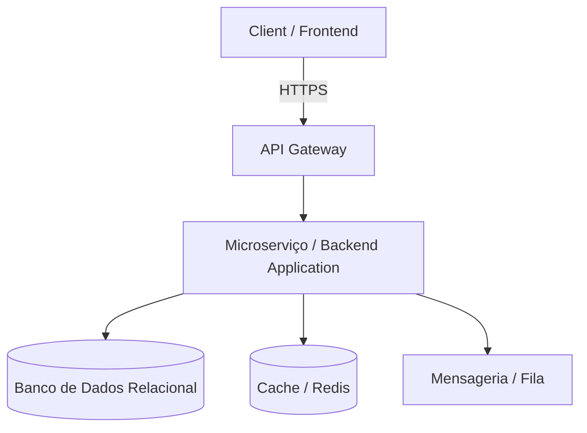

# SPEC — {{project}} v{{version}}

```json
{
  "_type": "harness-spec-v6",
  "id": "spec-{{project}}-v{{version}}",
  "version": {{version}},
  "status": "draft",
  "project": "{{project}}",
  "createdAt": "{{createdAt}}",
  "updatedAt": "{{updatedAt}}"
}
```

---

## 1. Metadados e Governança

*   **Autor/Dono:** [Seu Nome / Cargo]
*   **Revisores Técnicos:** [Nomes dos Engenheiros/Tech Leads]
*   **Stakeholders:** [Product Manager / Designers]
*   **Status:** `[Draft / Em Revisão / Aprovado / Obsoleto]`
*   **Data de Criação:** DD/MM/AAAA | **Última Atualização:** DD/MM/AAAA
*   **Documentos Relacionados:** [Link do PRD] | [Link do Figma/Wireframe]

---

## 2. Objetivos e Escopo Técnico

### 2.1 Objetivos Técnicos (Goals)
*   O que este design técnico *vai* resolver (ex: suportar X requisições por segundo, garantir idempotência no checkout).
*   Métricas técnicas esperadas (ex: latência de escrita < 200ms).

### 2.2 Não-Objetivos (Non-Goals)
*   O que este design técnico explicitamente *não* vai resolver agora (evita desperdício de escopo e overengineering).

---

## 3. Arquitetura do Sistema

### 3.1 Diagrama de Visão Geral (High-Level Design)



### 3.2 Componentes Impactados
*   **Novos Serviços:** [Nome do serviço, linguagem/framework, responsabilidade].
*   **Serviços Modificados:** [O que muda nos serviços existentes].
*   **Dependências Externas:** [APIs de terceiros, Webhooks, gateways].

---

## 4. Modelo de Dados e Persistência

### 4.1 Estrutura de Tabelas / Coleções (Data Schema)
Descreva as alterações no banco de dados. Se estiver usando ORMs ou migrations, detalhe a estrutura:

*   **Tabela / Coleção:** `users_payments` (Exemplo)
    *   `id`: `UUID` (Primary Key)
    *   `user_id`: `UUID` (Foreign Key -> `users.id`)
    *   `status`: `VARCHAR(50)` (Enum: `PENDING`, `SUCCESS`, `FAILED`)
    *   `metadata`: `JSONB`
    *   `created_at`: `TIMESTAMP WITH TIME ZONE`

### 4.2 Estratégia de Migração de Dados
*   Como será aplicada a alteração em produção sem gerar *downtime*?
*   Haverá necessidade de *data backfill* (popular registros antigos)? Se sim, qual o plano?

---

## 5. Contratos de Interface e Integração

### 5.1 Endpoints REST / GraphQL / gRPC
Documente o comportamento exato das rotas criadas ou alteradas.

#### `POST /v1/payments/checkout`
*   **Descrição:** Processa o pagamento do carrinho de compras.
*   **Autenticação:** Obrigatória (`Bearer Token`).

**Request Body (Exemplo):**
```json
{
  "cart_id": "8b5f3a12-c923-4d81-8e4b-927163ef44ab",
  "payment_method": "credit_card",
  "card_token": "tok_123456789"
}
```

**Response (Success - `201 Created`):**
```json
{
  "transaction_id": "tx_99887766",
  "status": "processing",
  "estimated_delivery": "2026-07-01T14:00:00Z"
}
```

### 5.2 Eventos e Mensageria (Assíncrono)
Se o sistema for orientado a eventos:
*   **Publisher:** Quem dispara o evento e qual o gatilho?
*   **Subscriber:** Quem consome o evento?
*   **Payload do Evento:** Estrutura do JSON que trafega na fila.

---

## 6. Lógica de Negócio e Casos de Borda (Edge Cases)

### 6.1 Algoritmos e Regras de Validação
*   Como tratar concorrência (ex: dois cliques seguidos)? Lock otimista ou travas de idempotência?
*   Políticas de expiração (Tokens, sessões, carrinhos abandonados).

### 6.2 Matriz de Tratamento de Erros

| Cenário de Falha | Impacto | Ação de Mitigação / Resposta do Sistema |
| :--- | :--- | :--- |
| Gateway de pagamento fora do ar | Bloqueio de vendas | Retentativa com Exponential Backoff + Alerta. |
| Banco de dados com timeout | Latência alta | Retornar `503 Service Unavailable` amigável. |

---

## 7. Infraestrutura, Segurança e DevOps

### 7.1 Alterações de Infraestrutura (IaC / Cloud)
*   Mudanças necessárias no ambiente (Azure, AWS, Docker Compose, etc.).
*   Novas variáveis de ambiente (`.env`) necessárias.

### 7.2 Segurança e Compliance
*   **Criptografia:** Dados sensíveis criptografados em trânsito (TLS) e em repouso (AES-256)?
*   **LGPD / GDPR:** Há armazenamento de dados pessoais (PII)? Como serão anonimizados ou deletados?
*   **Autenticação e Autorização:** Quais roles/permissões têm acesso?

---

## 8. Observabilidade e Monitoramento

*   **Logs Críticos:** Quais eventos geram logs de auditoria? (Evite logar dados sensíveis como cartões ou senhas).
*   **Métricas:** Quais KPIs técnicos precisamos acompanhar (ex: taxa de erro 5xx, latência)?
*   **Alertas:** Em qual condição o time deve ser acionado (ex: taxa de erro > 1% por 5 min)?

---

## 9. Estratégia de Rollout e Rollback (Plano de Deploy)

### 9.1 Plano de Rollout
*   Uso de **Feature Flags / Feature Toggles** para liberação gradual?
*   Janela de deploy recomendada (Horário de baixo tráfego).

### 9.2 Plano de Rollback
*   Se o deploy falhar, qual o passo a passo para reverter?
*   O rollback do código exige rollback de banco de dados? (Cuidado ao dropar colunas!).

---

## 10. Alternativas Consideradas

*Breve resumo das outras abordagens arquiteturais discutidas e o motivo pelo qual foram descartadas (ex: "Consideramos usar MongoDB para este fluxo, mas optamos pelo PostgreSQL devido à necessidade estrita de transações ACID e integridade referencial").*
